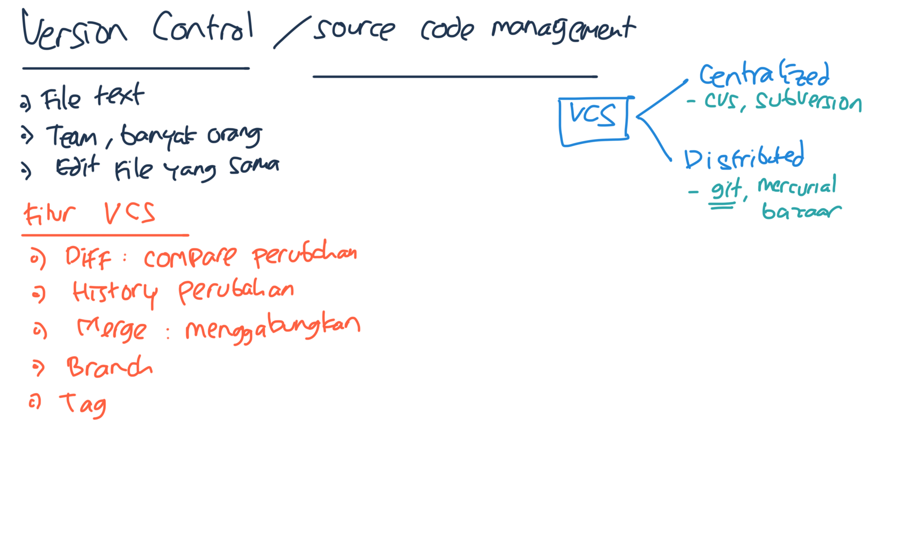
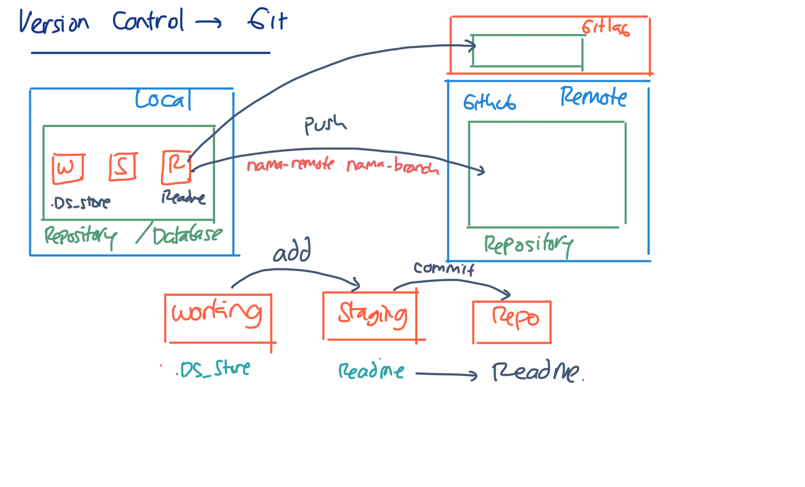
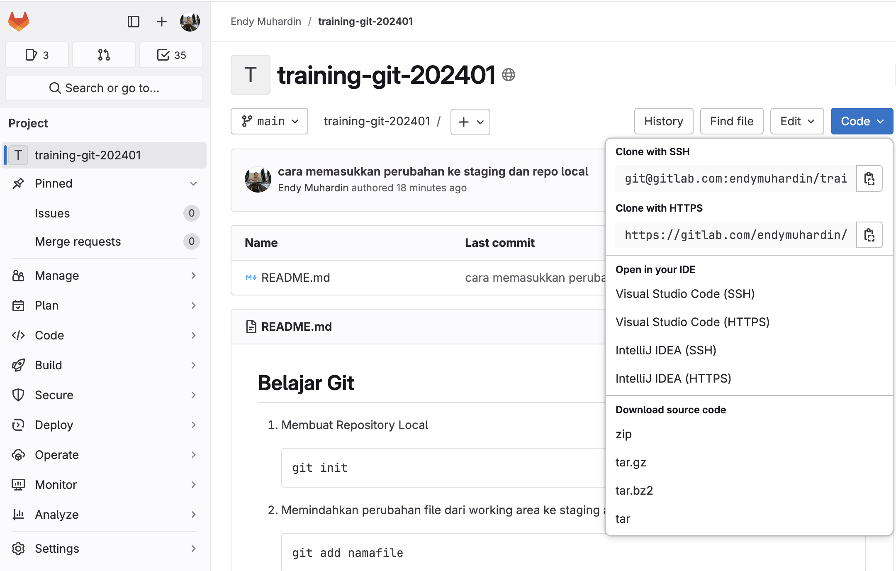

# Belajar Git #

[](img/konsep-version-control.png)

[](img/local-remote-repo.png)

[](img/fetch-merge.png)

## Membuat Repository

1. Membuat Repository Local

    ```
    git init
    ```

2. Memindahkan perubahan file dari working area ke staging area

    ```
    git add namafile
    ```

3. Menyimpan perubahan yang ada di staging ke repository local

    ```
    git commit
    ```

    Atau

    ```
    git commit -m "Commit pertama"
    ```

## Membuat Repository Remote ##

1. Buat repository di Github atau Gitlab

2. Copy repository URL

3. Daftarkan URL di repo local

    ```
    git remote add github git@github.com:endymuhardin/training-git-202401.git
    ```

4. Push local branch ke remote

    ```
    git push github main
    ```

5. Supaya next time tidak perlu menyebutkan remote dan branch, gunakan opsi `-u`

    ```
    git push -u github main
    ```

## Mengambil Repository dari Remote ##

1. Pergi ke website remote repo, kemudian copy paste URL repositorynya

    [](img/git-url.png)

2. Jalankan git clone

    ```
    git clone <url-repository>
    ```

3. Melihat daftar branch local dan remote

    ```
    git branch --all
    ```

4. Mengambil perubahan dari remote repo ke branch remote di local repo

    ```
    git fetch github/main
    ```

5. Menggabungkan perubahan dari branch remote ke branch local

    ```
    git merge github/main
    ```